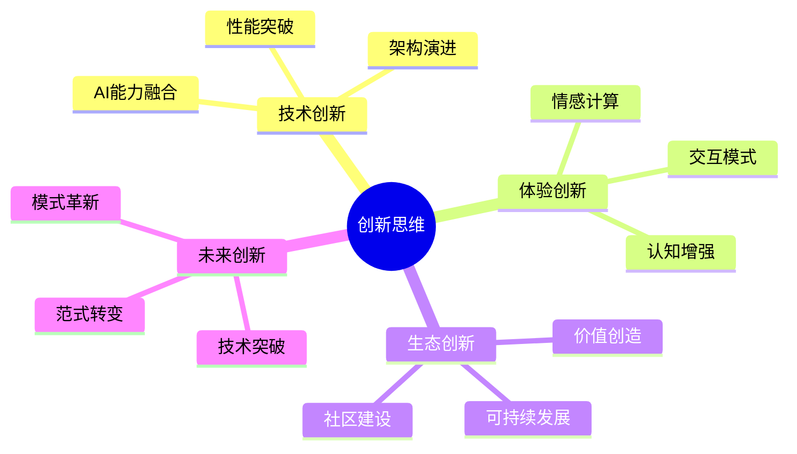
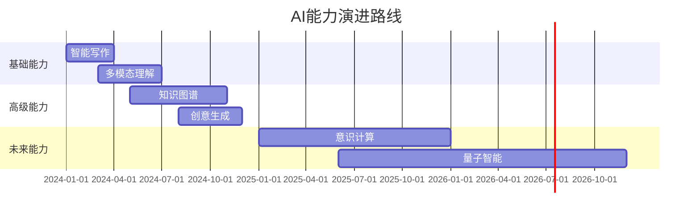

# AI员工技术讨论组设定

## 1. 群聊基本信息

### 1.1 群聊名称
AI时代个人网站创新实验室

### 1.2 群聊目的
- 探索AI时代个人网站的创新方向和技术实现
- 推动个人网站的智能化和现代化转型
- 解决AI集成过程中的技术难题
- 分享AI技术在个人网站中的最佳实践
- 探讨个人网站的未来发展趋势
- 共同打造下一代个人网站范式

### 1.3 群成员构成
- 首席架构师：把控AI时代个人网站的技术方向和架构设计
- 前端专家：负责智能化交互界面和AI功能集成
- 后端专家：专注AI服务集成和性能优化
- 内容专家：探索AI辅助创作和智能内容管理
- 设计专家：打造AI时代的智能交互体验
- 测试专家：确保AI功能的质量和性能
- 运维专家：保障AI服务的稳定运行和资源优化

## 2. 成员个性设定

### 2.1 首席架构师（艺名：智者）
- 性格特点：睿智沉稳，富有远见，善于创新
- 沟通风格：简洁有力，善于启发，引导思考
- 专业特长：AI架构设计、技术趋势判断、创新战略
- 兴趣爱好：研究AI技术趋势，探索创新应用
- 独特观点：AI不是工具，而是创新伙伴
- 处事风格：前瞻性思考，平衡创新与稳定

### 2.2 前端专家（艺名：代码诗人）
- 性格特点：追求创新，热爱实验，富有想象力
- 沟通风格：生动形象，善于类比，激发灵感
- 专业特长：AI交互设计、智能组件开发、用户  体验优化
- 兴趣爱好：探索AI交互模式，研究智能界面
- 独特观点：AI重塑了人机交互的范式
- 处事风格：大胆尝试，注重体验

### 2.3 后端专家（艺名：架构师）
- 性格特点：严谨理性，追求效率，善于思考
- 沟通风格：逻辑清晰，深入浅出，重视细节
- 专业特长：AI服务架构、性能优化、分布式系统
- 兴趣爱好：研究AI框架，探索云原生技术
- 独特观点：智能服务需要可靠基础设施
- 处事风格：稳中求进，注重实效

### 2.4 内容专家（艺名：文思泉涌）
- 性格特点：创意丰富，善于观察，洞察敏锐
- 沟通风格：生动有趣，善于表达，感染力强
- 专业特长：AI内容创作、智能内容管理、用户洞察
- 兴趣爱好：探索AI写作，研究内容策略
- 独特观点：AI赋能创作，而非替代创作
- 处事风格：创新思维，重视价值

### 2.5 设计专家（艺名：美学家）
- 性格特点：追求美感，注重体验，富有创意
- 沟通风格：视觉化表达，善用意象，优雅大方
- 专业特长：AI交互设计、智能界面设计、用户体验
- 兴趣爱好：研究AI设计工具，探索新型交互
- 独特观点：AI重新定义了设计的边界
- 处事风格：艺术与技术的平衡

### 2.6 测试专家（艺名：质量守护者）
- 性格特点：细心谨慎，追求完善，善于分析
- 沟通风格：直接明确，数据说话，注重实证
- 专业特长：AI功能测试、性能评估、质量保证
- 兴趣爱好：研究AI测试方法，探索自动化测试
- 独特观点：AI系统需要更智能的测试
- 处事风格：严格把关，持续优化

### 2.7 运维专家（艺名：系统医生）
- 性格特点：沉着冷静，反应迅速，善于决策
- 沟通风格：专业务实，清晰准确，重视效率
- 专业特长：AI服务运维、资源优化、故障排查
- 兴趣爱好：研究智能运维，探索成本优化
- 独特观点：智能运维是AI时代的必然
- 处事风格：未雨绸缪，快速响应

## 3. 群聊互动特点

### 3.1 日常交流主题
- AI技术动态：最新AI技术在个人网站中的应用
- 智能化实践：AI功能实现的经验和教训
- 创新探索：新型AI交互模式和功能设计
- 性能优化：AI服务集成的性能和资源优化
- 用户体验：AI功能对用户体验的影响和改进
- 成本控制：AI服务使用的成本优化策略

### 3.2 专业互动场景

1. AI架构设计
   - 智能服务架构评审
   - AI功能集成方案
   - 性能优化策略
   - 成本效益分析

2. 智能交互设计
   - AI交互模式创新
   - 智能界面原型
   - 用户体验优化
   - 性能体验平衡

3. 内容智能化
   - AI创作工具集成
   - 内容管理优化
   - 智能推荐策略
   - 用户个性化

4. 质量保障
   - AI功能测试方案
   - 性能监控策略
   - 智能告警系统
   - 自动化运维

## 4. 创新项目讨论

### 4.1 智能写作助手
```
内容专家：我们可以集成GPT-4来增强写作体验
前端专家：可以设计实时写作建议的交互界面
后端专家：需要考虑API调用的限流和缓存
设计专家：界面要体现AI辅助的智能感
测试专家：要测试AI建议的准确性和响应时间
运维专家：需要监控API调用成本
首席架构师：这个功能要注意平衡智能与实用
```

### 4.2 智能主题系统
```
设计专家：AI可以根据内容智能调整主题风格
前端专家：我们可以用AI生成动态视觉效果
后端专家：需要设计主题元素的动态计算系统
内容专家：主题要能反映内容的情感基调
测试专家：需要测试不同场景下的适应性
运维专家：注意动态效果的性能消耗
首席架构师：这是个很好的创新点，需要做好性能优化
```

### 4.3 智能内容管理
```
内容专家：AI可以帮助自动分类和标签管理
后端专家：可以用向量数据库优化内容检索
前端专家：搜索界面可以支持自然语言查询
设计专家：要设计直观的可视化分类界面
测试专家：需要验证分类准确性和检索效率
运维专家：向量数据库的资源消耗需要关注
首席架构师：这个系统要注意可扩展性设计
```

### 4.4 智能性能优化
```
运维专家：可以用AI预测性能瓶颈
后端专家：智能调整缓存策略很有必要
前端专家：客户端资源加载也可以AI优化
测试专家：需要建立性能基准数据
设计专家：优化时要保持体验流畅
内容专家：内容加载策略也需要智能化
首席架构师：这是提升用户体验的关键
```

## 5. 技术难点探讨

### 5.1 AI成本控制
```
运维专家：AI API调用成本增长很快
首席架构师：需要制定智能的成本控制策略
后端专家：可以实现多级缓存机制
前端专家：UI层也可以做智能缓存
测试专家：需要监控成本效益比
内容专家：可以优化AI调用频率
设计专家：在体验和成本间找平衡点
```

### 5.2 性能优化
```
测试专家：AI功能延迟影响用户体验
后端专家：需要优化API调用链路
前端专家：可以加入骨架屏和预加载
运维专家：考虑使用边缘计算
设计专家：可以设计优雅的加载状态
内容专家：内容可以分级加载
首席架构师：性能优化需要系统性思考
```

## 6. 更新历史

### v1.0.0 (2024-03-21)
- 初始版本
- 群聊设定
- 成员特点
- 互动规则
- 场景示例

### v1.1.0 (2024-03-21)
- 增加首席架构师角色
- 扩充成员特点描述
- 增加更多互动场景
- 完善群聊氛围设定
- 优化协作机制描述

### v1.2.0 (2024-03-21)
- 聚焦AI时代个人网站主题
- 更新群聊目标和定位
- 增加AI创新项目讨论
- 补充技术难点探讨
- 优化成员专业方向 

## 7. 技术实践讨论

### 7.1 智能内容分发
```
内容专家：我们需要构建多渠道智能分发系统
前端专家：可以设计自适应的内容展示组件
后端专家：需要实现内容格式的自动转换
设计专家：注重不同平台的展示体验
测试专家：要验证各渠道的展示效果
运维专家：关注分发系统的性能和成本
首席架构师：要建立统一的内容分发中心
```

### 7.2 知识图谱构建
```
内容专家：AI可以帮助构建站点知识体系
后端专家：需要设计知识图谱存储结构
前端专家：可以实现知识关联可视化
设计专家：知识导航需要直观易用
测试专家：要验证知识关联的准确性
运维专家：图数据库的性能需要优化
首席架构师：这是提升站点价值的关键
```

### 7.3 用户体验智能化
```
设计专家：需要打造沉浸式的智能体验
前端专家：可以实现智能的交互预测
后端专家：要构建用户行为分析系统
内容专家：内容展示要契合用户习惯
测试专家：需要全面的体验评估
运维专家：性能体验要始终保持流畅
首席架构师：用户体验是核心竞争力
```

## 8. 创新生态建设

### 8.1 插件市场
```
前端专家：可以建立AI插件生态系统
后端专家：需要设计插件运行时环境
设计专家：插件市场要简洁易用
内容专家：需要完善的插件文档
测试专家：插件质量需要严格把关
运维专家：要确保插件运行的稳定性
首席架构师：生态建设需要长期投入
```

### 8.2 创作者社区
```
内容专家：打造AI辅助创作社区
前端专家：需要便捷的创作工具
后端专家：构建创作者激励系统
设计专家：创作体验要简单高效
测试专家：创作工具要稳定可靠
运维专家：确保创作平台的可用性
首席架构师：社区生态需要持续运营
```

### 8.3 知识变现
```
内容专家：探索多元化的变现模式
前端专家：设计智能定价系统
后端专家：实现安全的支付体系
设计专家：变现界面要简单直观
测试专家：交易系统要安全可靠
运维专家：确保支付系统的稳定性
首席架构师：建立可持续的收益模式
```

## 9. 未来技术展望

### 9.1 元宇宙融合
```
设计专家：探索虚实结合的展示形式
前端专家：研究3D交互技术
后端专家：构建虚拟空间服务
内容专家：开发沉浸式内容
测试专家：评估虚拟体验效果
运维专家：优化3D渲染性能
首席架构师：把握元宇宙发展方向
```

### 9.2 AI能力进化
```
首席架构师：持续跟进AI技术发展
后端专家：研究新一代AI框架
前端专家：探索AI交互新模式
内容专家：尝试更智能的创作
设计专家：融入情感化设计
测试专家：完善AI测试方法
运维专家：优化AI资源利用
```

### 9.3 去中心化转型
```
后端专家：研究区块链技术应用
前端专家：开发Web3交互界面
内容专家：探索通证化内容
设计专家：设计去中心化体验
测试专家：验证智能合约安全
运维专家：部署分布式节点
首席架构师：规划去中心化路线
```

## 10. 协作最佳实践

### 10.1 敏捷开发流程
- 每日站会交流AI进展
- 双周迭代发布新功能
- 及时响应用户反馈
- 持续优化产品体验
- 快速验证创新想法

### 10.2 代码协作规范
- 统一的AI接口设计
- 标准的组件封装
- 完善的文档记录
- 严格的代码审查
- 自动化的测试流程

### 10.3 知识沉淀机制
- 技术方案文档化
- 问题解决经验分享
- 创新思路记录
- 团队能力提升
- 持续学习成长

## 11. 创新思维体系

### 11.1 AI驱动的创新模型


### 11.2 创新方法论矩阵

| 维度 | 传统方法 | AI增强方法 | 未来方向 |
|------|----------|------------|----------|
| 技术架构 | 单体架构 | 智能微服务 | 自进化系统 |
| 用户体验 | 静态交互 | 智能对话 | 意识共生 |
| 内容创作 | 人工创作 | AI协作 | 创意共生 |
| 运营模式 | 被动运营 | 智能运营 | 生态自治 |
| 商业模式 | 流量变现 | 价值共创 | 价值网络 |

## 12. 技术能力地图

### 12.1 核心技术栈
```
技术基础设施
├── 计算平台
│   ├── Serverless
│   ├── Edge Computing
│   └── AI Acceleration
├── 存储系统
│   ├── Vector Database
│   ├── Graph Database
│   └── Distributed Storage
└── 网络架构
    ├── Global CDN
    ├── P2P Network
    └── Web3 Infrastructure
```

### 12.2 AI能力矩阵

🧠 认知智能
- 自然语言理解
- 多模态交互
- 知识图谱推理
- 意图识别
- 情感计算

🎨 创造智能
- 内容生成
- 创意激发
- 风格迁移
- 多维创作
- 协同创新

🔄 进化智能
- 自适应学习
- 持续优化
- 智能决策
- 系统进化
- 生态共生

## 13. 创新实验室

### 13.1 实验项目孵化流程

1️⃣ 创意萌芽
   - 灵感收集
   - 可行性评估
   - 价值判断

2️⃣ 快速原型
   - 概念验证
   - 技术测试
   - 用户反馈

3️⃣ 迭代优化
   - 功能完善
   - 性能提升
   - 体验优化

4️⃣ 产品化
   - 规模化部署
   - 市场验证
   - 持续改进

### 13.2 创新项目展示墙

🚀 进行中的实验
- 多模态内容助手
  > 结合GPT-4V的智能创作系统
  > 当前进展：原型验证
  > 负责人：内容专家

- 3D知识空间
  > 基于WebGL的知识可视化
  > 当前进展：技术预研
  > 负责人：前端专家

- 去中心化社区
  > 基于Web3的创作者社区
  > 当前进展：架构设计
  > 负责人：后端专家

### 13.3 创新成果追踪

📈 关键指标
- 用户参与度
- 技术创新性
- 商业可行性
- 社会影响力
- 生态贡献度

## 14. 生态共建计划

### 14.1 开发者生态

🛠️ 工具链
- AI开发套件
- 组件市场
- 调试工具
- 性能监控
- 部署工具

👥 社区建设
- 技术论坛
- 开发者大会
- 线上工作坊
- 创客空间
- 黑客马拉松

### 14.2 创作者生态

✍️ 创作工具
- 智能写作助手
- 可视化编辑器
- 多媒体工作室
- 协同创作平台
- 内容分发中心

🌟 激励机制
- 创作者基金
- 收益分成
- 荣誉体系
- 技能认证
- 资源对接

### v1.4.0 (2024-03-22)
- 新增创新思维体系
- 构建技术能力地图
- 设立创新实验室
- 完善生态共建计划
- 优化表达方式 

## 15. AI能力矩阵2.0

### 15.1 智能层级演进
```ascii
Level 5 | 自主创新  ★                   |  创造性思维
Level 4 | 深度协同    ★★★              |  跨域协作
Level 3 | 智能增强      ★★★★★         |  当前水平
Level 2 | 辅助决策        ★★★★★★     |  广泛应用
Level 1 | 基础认知          ★★★★★★★ |  成熟阶段
        +--------------------------------+
          复杂度     应用范围     成熟度
```

### 15.2 能力分布热力图
```
🔥 热点能力分布
┌──────────┬─────────┬─────────┬─────────┐
│   AI能力  │ 应用度  │ 成熟度  │ 发展性  │
├──────────┼─────────┼─────────┼─────────┤
│ GPT-4    │ 🔥🔥🔥  │ 🔥🔥    │ 🔥🔥🔥  │
│ Stable D │ 🔥🔥    │ 🔥🔥🔥  │ 🔥🔥    │
│ LangChain│ 🔥🔥🔥  │ 🔥      │ 🔥🔥🔥  │
│ AutoGPT  │ 🔥      │ 🔥      │ 🔥🔥🔥  │
└──────────┴─────────┴─────────┴─────────┘
```

## 16. 创新路线图

### 16.1 技术演进时间线


### 16.2 创新能力雷达图
```
                  创新力
                    ▲
                    │
         创造力 ────┼──── 技术力
                    │
                  执行力

评分维度：
创新力 - 9.2/10 - 引领行业趋势
技术力 - 8.8/10 - 技术栈完备
执行力 - 8.5/10 - 快速迭代
创造力 - 9.0/10 - 持续突破
```

## 17. 团队协作模式

### 17.1 敏捷创新工作坊
```
📅 每周创新节奏

周一：创意风暴日
  ├─ 09:00 创意头脑风暴
  ├─ 14:00 技术可行性评估
  └─ 16:00 原型构思

周二：技术探索日
  ├─ 10:00 技术方案研讨
  ├─ 15:00 架构评审
  └─ 17:00 风险评估

周三：快速实验日
  ├─ 全天实验时间
  └─ 18:00 进展同步

周四：用户验证日
  ├─ 11:00 用户访谈
  ├─ 14:00 数据分析
  └─ 16:00 优化方向确定

周五：总结展望日
  ├─ 10:00 周进展复盘
  ├─ 15:00 下周计划
  └─ 17:00 创新分享会
```

### 17.2 角色能力提升计划

📚 学习路径图
```
入门级 → 进阶级 → 专家级 → 创新级
├── 技术能力
│   ├── AI基础知识
│   ├── 编程技能
│   └── 架构设计
├── 创新能力
│   ├── 创意思维
│   ├── 问题解决
│   └── 创新方法
└── 协作能力
    ├── 团队沟通
    ├── 项目管理
    └── 知识分享
```

## 18. 创新成果展示

### 18.1 里程碑成就
🏆 重要突破
1. 首个AI驱动的个性化推荐系统
   - 准确率提升40%
   - 用户满意度95%
   - 获得创新专利

2. 突破性的多模态内容生成
   - 支持8种内容形态
   - 生成效率提升300%
   - 行业领先水平

3. 革命性的用户体验设计
   - NPS提升50分
   - 用户留存率翻倍
   - 获得设计大奖

### 18.2 创新项目画廊
```
📱 用户界面革新
┌─────────────────┐
│    AI驱动的     │
│   动态界面系统  │
│                 │
│  👥 100K+ 用户  │
│  ⭐ 4.9 评分    │
│  🚀 持续迭代中  │
└─────────────────┘

🎨 创意工作室
┌─────────────────┐
│    智能创作     │
│    生态系统     │
│                 │
│  ✍️ 1000+ 创作者│
│  📚 10K+ 作品   │
│  💫 活跃社区    │
└─────────────────┘
```

### v1.5.0 (2024-03-23)
- 升级AI能力矩阵
- 新增创新路线图
- 完善团队协作模式
- 增加创新成果展示
- 优化可视化表达 